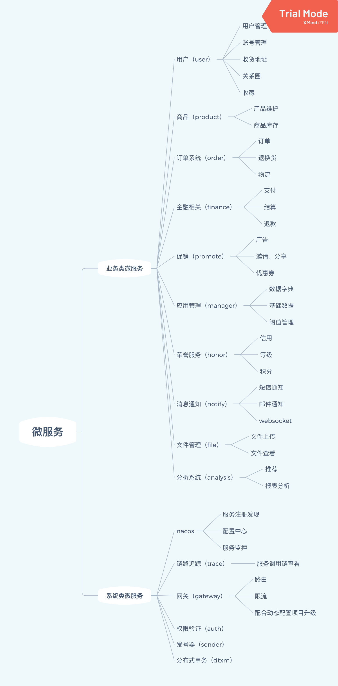

# Spring Cloud
## 微服务划分

- 分服务

- 分内外

  接口分为内外两种：

  外部接口就是用户从前台页面可以直接访问的接口，一般为 http 或者 websocket为主；

  内部接口就是微服务之间相互调用的接口，一个接口往往由内部多个方法组建构成，比如支付时候，需要通过订单服务查询订单信息，还需要通过券系统验证优惠券，最后还需要发送消息给用户表示支付完成。被支付服务所调用的接口都是内部接口。接口接口一般为 Feign 接口，rpc 接口，还有 pub /sub 模型对应的消息方式。

- 分包

  一个清楚的分包就是一个清晰的模型，充分利用 Spring Boot 的默认包扫描路径，可以减少一些不必要的配置，同时一个合理的包结构，很大程度上避免了类的冲突。约定优于配置。

